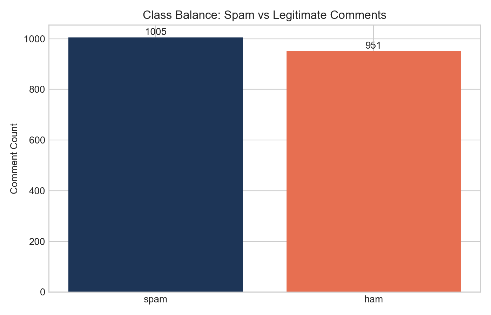
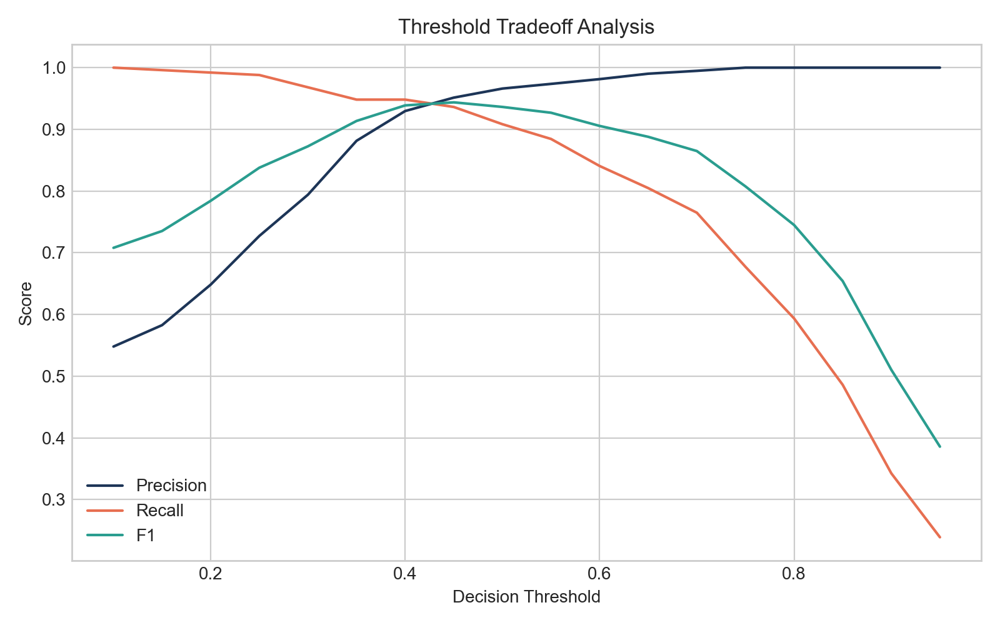
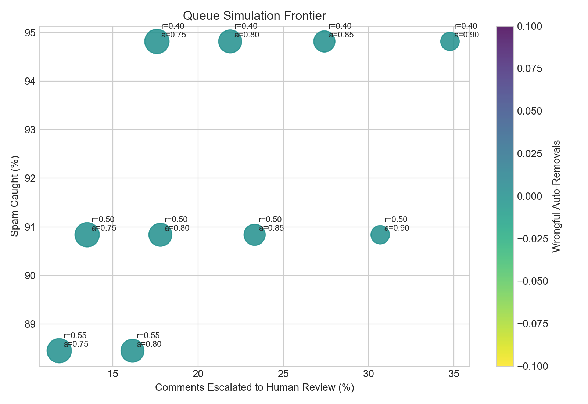

# YouTube Comment Spam Detection & Review Queue Optimization

This project uses the public UCI YouTube Spam Collection to build a simple comment moderation prototype. The goal is to classify spam comments, study model performance, and simulate a review queue for human moderators.

The project is designed as an analytics workflow. It includes data preparation, model training, threshold analysis, error analysis, and a Streamlit app for interactive review.

Live app: add your Streamlit Community Cloud URL here after deployment.

## Project overview

The project focuses on three questions:

- Can we detect likely spam comments from public labeled data?
- How do model thresholds change precision and recall?
- How can a moderation team split comments into allow, review, and auto-remove groups?

This is a prototype. It is not a production moderation system.

## Dataset

The project uses the public UCI YouTube Spam Collection.

- 1,956 labeled comments
- 5 YouTube videos
- Binary labels: spam and non-spam

The raw files are stored in [`data/raw`](/Users/trshwetha7/Desktop/Youtube-project/data/raw).

## Repository structure

```text
youtube-comment-spam-review-optimization/
├── app/
├── data/
├── docs/
├── models/
├── notebooks/
├── outputs/
├── src/
├── README.md
└── requirements.txt
```

## Method

The workflow has four main parts.

### 1. Data preparation

- Load the five dataset files
- Clean text
- Handle missing values
- Create simple text-based features

### 2. Exploratory analysis

- Class balance
- Common spam words and phrases
- Comment length patterns
- Differences between spam and non-spam comments

### 3. Modeling

Three models are trained and compared:

- TF-IDF + Logistic Regression
- TF-IDF + Multinomial Naive Bayes
- TF-IDF + Random Forest

### 4. Review queue simulation

Model scores are used to split comments into three groups:

- Auto-remove
- Human review
- Allow

This helps estimate reviewer workload and moderation tradeoffs.

## Model results

The models were evaluated on a held-out test set.

| Model | Precision | Recall | F1 | PR-AUC | ROC-AUC |
| --- | ---: | ---: | ---: | ---: | ---: |
| Logistic Regression | 0.966 | 0.908 | 0.936 | 0.983 | 0.978 |
| Random Forest | 0.967 | 0.928 | 0.947 | 0.987 | 0.982 |
| Multinomial Naive Bayes | 0.889 | 0.928 | 0.908 | 0.976 | 0.970 |

Random Forest gave the best test F1. Logistic Regression was also saved as the main deployed model because it is easier to explain.

## Review queue policy

The default policy in this project is:

- `spam_probability >= 0.85`: auto-remove
- `0.55 <= spam_probability < 0.85`: send to review
- `spam_probability < 0.55`: allow

On the held-out test set, this policy produced:

- 24.9% auto-removed
- 21.7% sent to review
- 53.4% allowed
- 88.4% of spam caught
- 0 wrongful auto-removals in the test set

## Error analysis

The project includes false positive and false negative review tables. These help show which comments are hard to classify and why threshold choice matters.

## Streamlit app

The app includes these sections:

- Overview
- Data Exploration
- Model Performance
- Threshold Simulator
- Review Queue Dashboard
- Error Analysis
- Live Comment Scoring

Main app file:

- [`app/streamlit_app.py`](/Users/trshwetha7/Desktop/Youtube-project/app/streamlit_app.py)

## Notebook

The notebook walks through the full workflow from data loading to final conclusions.

- [`notebooks/youtube_spam_detection_end_to_end.ipynb`](/Users/trshwetha7/Desktop/Youtube-project/notebooks/youtube_spam_detection_end_to_end.ipynb)

## Charts

Generated charts are saved in [`outputs/charts`](/Users/trshwetha7/Desktop/Youtube-project/outputs/charts).

Example charts:







## Screenshots

You can add one or two screenshots from the Streamlit app in this section after deployment.

## How to run

Create the environment and install dependencies:

```bash
cd /Users/trshwetha7/Desktop/Youtube-project
python3 -m venv .venv
source .venv/bin/activate
pip install -r requirements.txt
```

Train the models and generate outputs:

```bash
PYTHONPATH=src python3 -m youtube_spam_detector.train
```

Run JupyterLab without opening a browser:

```bash
jupyter lab --no-browser --ip=127.0.0.1 --port=8888
```

Run Streamlit without opening a browser:

```bash
PYTHONPATH=src streamlit run app/streamlit_app.py --server.headless true --server.address 127.0.0.1 --server.port 8501
```

## Streamlit Community Cloud

If you want a live public link, you can deploy the app through Streamlit Community Cloud.

Basic steps:

1. Push this repository to GitHub.
2. Go to [Streamlit Community Cloud](https://share.streamlit.io/).
3. Sign in with GitHub.
4. Choose this repository.
5. Set the main file path to `app/streamlit_app.py`.
6. Deploy the app.

This is usually the easiest free option for a small Streamlit project.

## Limitations

- The dataset is small.
- The labels only cover spam and non-spam.
- This is not the same as internal YouTube moderation data.
- Public YouTube API data does not expose moderation status for arbitrary channels or videos.

## Author

Shweta Tinniyam Raju
